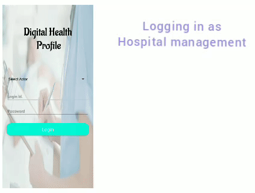
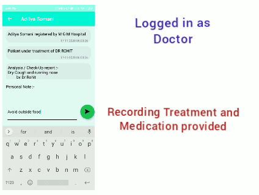

# Goal_Diggers!
## Idea of the project

## Video Demo
 

## Basic Issues faced

## Working of the prototype:

## Recommendation System :

  
## How to Run:
## For Reccommendation Portal
  - Clone the repository
  - To test the website on local machine check the dependencies in - Health_Profile/requirements.txt
  - To use app install the apk in your device 
## For App :-
1. Download the APK and install it in android device.
2. Login Details for various Actors of the system :-
> Patient :- 
  Sample : 
  Login Id :- 123456789000 
  Password :- 123456789000 
  (All new Registered patients will have there Unique Id as Login Id and Password both) 
  
> Doctor :- 
  Sample : 
  Login Id :- rohit 
  Password :- rohit123 
    
> Hospital Management :- 
  Sample : 
  Login Id :- mgm 
  Password :- mgm123 
    
> Medical Stdudent :- 
  Sample : 
  Login Id :- student 
  Password :- student123 
    
> Pharmacist :- 
  Sample : 
  Login Id :- pharmacist 
  Password :- pharmacist123 
3. Data can be accessed by variuos actors as per there privilenges.
